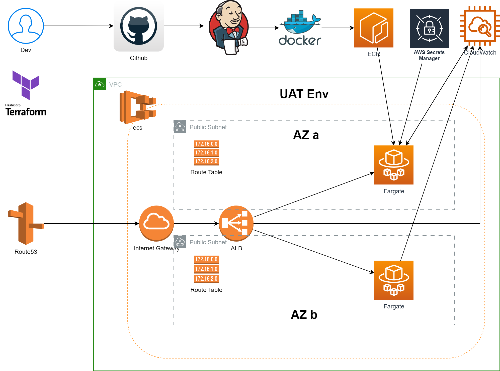
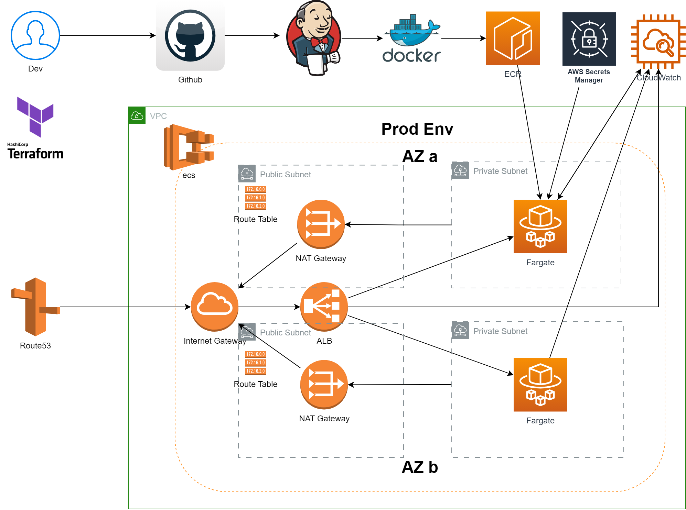
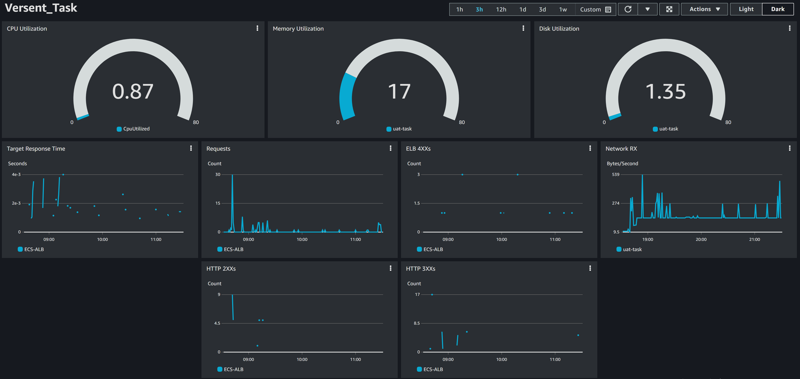

## Solutions

1. Backend API:
   - The backend API is built using Node.js and Express.
   - It uses a data.json file as the data source since only the GET method is used, eliminating the need for a MongoDB/Dynamodb database.
2. Logic Solution:
   - The logic solution is implemented in the **`dataService.js`** file located within the service folder.
3. Swagger Documentation:
   - Proper Swagger documentation has been set up, providing details for the following endpoints:
     - **`/people`**
     - **`/locations`**
     - **`/closecontacts`**
   - The Swagger documentation can be accessed at: **[Swagger Docs](https://uat-versent-api.shawnwang.site/api-docs/) (**[https://uat-versent-api.shawnwang.site/api-docs/](https://uat-versent-api.shawnwang.site/api-docs/)**)**
4. Cloud Resources:
   - All the required cloud resources have been deployed in AWS, including:
     - Route53 for DNS management
     - ALB (Application Load Balancer) for load balancing incoming requests
     - ECR (Elastic Container Registry) for storing container images
     - ECS (Elastic Container Service) for container orchestration
     - SM (Secrets Manager) for securely storing and accessing secrets
     - CW (CloudWatch) for monitoring and logging
5. Infrastructure as Code (IaC):
   - The setup of all cloud resources has been automated using Terraform, ensuring consistent and reproducible infrastructure deployments.
6. CI/CD Pipeline:
   - CI/CD pipelines have been implemented for both the UAT (User Acceptance Testing) and PROD (Production) environments.
   - The pipelines are configured using Terraform and include the necessary steps for building, testing, and deploying the backend code.
7. Monitoring:
   - Monitoring has been properly set up for ECS (Elastic Container Service) and ALB (Application Load Balancer) to ensure visibility into the performance and health of the deployed infrastructure.

### Logic Solution

1. Find every PERSON that has visited a particular LOCATION on a specific date:
   - Filter the JSON data to retrieve the items that match the particular location.
   - Extract the persons array from each item, creating a flat array without the location information.
   - Filter the extracted persons array based on the specific date to find the persons who visited the location on that date.
2. Find every LOCATION that a particular PERSON has visited on a specific date:
   - Iterate through each person in the JSON data.
   - For each person, directly find the locations they visited on the specific date.
3. Given a specific PERSON and date, identify their CLOSE CONTACTS on that date:
   - Use the solution from Scenario 2 to find the locations visited by the specific person on the given date.
   - Use the solution from Scenario 1 to find all the people who visited the locations identified in the previous step on the same specific date.
   - Utilize a set to collect the close contact people, excluding the specific PERSON.

### Solution Archtect

- UAT ENV(Deployed):
  
- PROD ENV:
  

1. Cost Management:
   - The solution is designed to optimize cost management by providing the UAT environment only.
2. ECS Fargate with Autoscaling:
   - The solution utilizes ECS Fargate for container orchestration, offering scalability and flexibility.
   - The configuration for autoscaling based on CloudWatch monitoring is as follows:
     - The desired number of tasks (containers) is set to 2 initially.
     - The maximum number of tasks is capped at 6 to ensure resource availability during peak periods.
     - The minimum number of tasks is set to 1 to maintain at least one container for stability.
     - Autoscaling policies are defined based on CPU usage, with thresholds set at 10 and 85. If the CPU usage falls below 10, the system scales down, and if it exceeds 85, the system scales up to meet demand.
3. Environment Variables from AWS Secret Manager:
   - The solution retrieves the required environment variables from AWS Secrets Manager, ensuring secure storage and access to sensitive information.
4. Container Health Check:
   - Considering the vulnerability of Docker containers, an ALB (Application Load Balancer) is employed to periodically check the working status of ECS containers.
   - The ALB performs a health check by accessing the **`/health_check`** URL, ensuring that containers are functioning properly. If any issues are detected, the ALB automatically restarts a new container.

### Monitoring - CloudWatch

Access Link: [CloudWatch Dashboard](https://cloudwatch.amazonaws.com/dashboard.html?dashboard=Versent_Task&context=eyJSIjoidXMtZWFzdC0xIiwiRCI6ImN3LWRiLTA0NjM4MTI2MDU3OCIsIlUiOiJ1cy1lYXN0LTFfWHBHNTFMalRWIiwiQyI6IjZhaXVsajQyY25ucHI1bHRzajMzb2I5OGgiLCJJIjoidXMtZWFzdC0xOmQ0NzlkMTUwLThmM2YtNDE3ZC04NmUxLWQwY2NiNjM4MjYyMyIsIk0iOiJQdWJsaWMifQ==)

## Summary

Node.js Express Architecture:

- Node.js Express provides a robust architecture for enterprise solutions, promoting high cohesion and loose coupling.
- By designing separate components such as models, controllers, routes, and services, the code can be organized effectively, facilitating future scalability and development.

AWS ECS Benefits:

- AWS ECS offers high availability, scalability, and reliability for enterprise applications.
- It supports various deployment strategies, including rolling updates and blue-green deployments, catering to different working requirements.
- ECS provides excellent flexibility, making it suitable for large-scale projects and facilitating future development and growth.

Infrastructure as Code (IaC) with Terraform:

- IaC with Terraform enables stable deployments across multiple cloud providers, not limited to AWS.
- By leveraging Terraform's capabilities and utilizing different variables, different working environments (e.g., UAT and PROD) can be easily deployed with minimal errors.
- This ensures consistent infrastructure deployments and simplifies environment management.

CI/CD with Jenkins:

- Jenkins, as a CI/CD tool, offers exceptional flexibility and security during the code deployment process.
- It enables efficient automation of building, testing, and deploying applications.
- Jenkins can be customized to meet specific requirements and integrate with various tools and processes, enhancing the overall development and deployment workflow.
